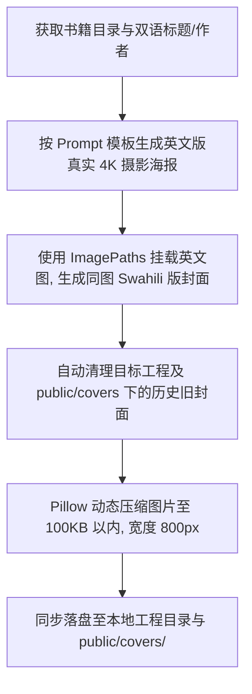

# 📚 非洲双语爽文小说爆款封面生成 Skill (Book Cover Generator)

本 Skill 总结了为非洲双语爽文小说（Soma Reader）定制生成**爆款打脸/豪门爽文/情感复仇风·高清真实人像海报级封面**的核心设计秘籍、构图排版标准与本地部署工作流。

---

## 🎯 1. 触发条件 (Trigger)

当用户在对话中发送以下任意指令时，自动激活本 Skill：
- `生成封面`
- `重做封面` / `重新生成封面`
- 提供某本书的本地路径并要求补全/修改封面

---

## 🎨 2. 封面设计四大核心秘籍 (Design Rules)

### 秘籍一：主角形象与顶级造型 (High-Fashion Glamour Characters)
- **女主 (Heroine)**：极具美感的东非高颜值女主，拥有**丰盈浓密的黑色长卷发/波浪长发**（long, voluminous wavy black hair），身着高定礼服（如香槟金亮片露背晚礼服、粉色立体花朵蕾丝裙、红色高开衩晚礼服），佩戴精致吊坠与耳环，眼神散发自信、魅惑或复仇的光芒。
- **男主 (Male Lead)**：帅气深情的东非霸总/豪门男主，身着修身黑色西装或无尾礼服（tuxedo），具有高挺硬朗的面部轮廓。
- **真实人像摄影质感**：使用 Hasselblad 4K 单反人像镜头描述，保留真实皮肤质感与自然光影，**严格拒绝 3D 塑料感与动漫卡通风**。

### 秘籍二：双重叙事与情感张力构图 (Dual-Scene Narrative Composition)
参照顶级非洲爽文封面标准，画面采用**分层双重叙事（Double-Layer Scene）**构图：
- **前景主视觉 (Foreground Main Focus)**：
  - 女主高光单人特写（或男女主深情相拥/对视）。
- **背景/副视觉 (Background / Secondary Inset Scene)**：
  - 左侧或上方副场景：男主与反派女配在露台上缠绵/背叛，或女主在夜店/法庭的隐秘身份副场景（如拿着 `LAW` 卷宗的律政精英形态），营造复仇、选择或多重身份的戏剧张力。
- **氛围装饰与框景 (Atmosphere & Framing)**：
  - 漫天飘落的**红玫瑰花瓣 (floating red rose petals)** 或飞舞的合同契约文书。
  - 前景底部使用盛开的红玫瑰花丛框景（blooming red roses framing）。
  - 黄昏逆光、城市天际线夕阳（Nairobi Sunset Skyline）或奢华宴会厅光影。

### 秘籍三：爆款 3D 重金属金字艺术字排版 (Typography)
- **3D 烫金主标题 (Main Title)**：
  - 使用 3D 浮雕金属金字（`3D bevelled golden metallic serif font`），搭配爱心/花纹装饰（heart decorative embellishments）。
- **副标题/斯瓦希里语小字 (Subtitle / Tagline)**：
  - 主标题下方配有粉色/白色斜体手写风副标题（例：`(Bikra yangu ilivyonipa maisha mazuri)`）。
- **底部作者署名 (Author Section)**：
  - `MTUNZI: [Author Name]` 或手写体署名，搭配精致下划线装饰。

### 秘籍四：同图同构双语法则 (Identical-Base Bilingual Pairing)
- **双语封面绝对不要生成两幅不同的底图！** 保持视觉主体与人物 100% 完全一致：
  1. **第一步**：使用 `generate_image` 生成英文版封面（例：`i_returned_on_the_day_of_division_en`）。
  2. **第二步**：使用 `generate_image` 且传入 `ImagePaths: ["/path/to/english_cover.jpg"]`，指令为：
     `Keep the exact same characters, photo, secondary scenes, floating rose petals, lighting, and composition from the reference image. Modify ONLY the title text: replace '[English Title]' with '[Swahili Title]' in the exact same 3D metallic gold font and position.`

---

## 📸 3. `generate_image` Prompt 提示词黄金模板

```text
A photorealistic 4K cinematic romance and revenge web-novel cover titled '[TITLE]'. Shot on Hasselblad camera, 85mm f/1.4 prime lens, natural skin texture with visible skin pores and fine details, completely real human face.

Foreground: A breathtakingly gorgeous 28-year-old East African heroine with long voluminous black wavy hair, wearing an elegant champagne gold sequined evening gown with diamond jewelry, looking at the camera with an intense confident smile.

Background dual-scene: On the left balcony during sunset, a handsome African billionaire in a black suit is embracing another woman in a red dress, creating dramatic story tension.

Details: Red rose petals floating through the warm golden evening air, glowing sparkles, red roses framing the bottom. Luxury Nairobi penthouse balcony background.

Typography: Bold 3D metallic gold serif typography for title '[TITLE]' with heart decorative accents, Swahili subtitle in elegant pink italic below, author name 'MTUNZI: [AUTHOR]' at the bottom.

Strictly photographic, zero 3D render, zero plastic look, zero digital painting.
```

---

## ⚙️ 4. 本地全流程部署工作流 (Local Deployment Workflow)



### 部署要求规则：
1. **自动清理旧封面**：删除目标小说工程目录及 `/public/covers/` 下对应的历史旧封面文件。
2. **压缩至 100KB 以内**：使用 Pillow 动态等比例缩放（宽度 800px），压缩至 100KB 以内（Quality 25-85 动态调整）。
3. **同步落盘本地目录**：自动将生成的双语封面保存至：
   - 本地小说工程根目录
   - 本地小说工程 `05_covers/` 目录（若存在）
   - 本地前端项目路径 `/Users/yvoche/AI开发/071_非洲阅读/public/covers/`
4. **无需同步线上**：本地生成与落盘部署完成即可，无需调用接口或更新云端 Live 数据库。

---

## ✅ 5. 交付标准

每次生成与本地部署完成后，向用户展示：
1. **英文版与斯瓦希里语版双语海报效果**。
2. **本地落盘路径与压缩大小（<100KB）确认**。
